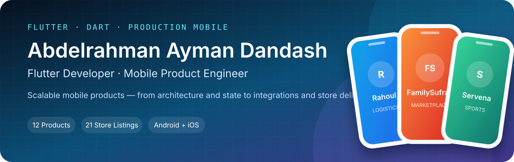
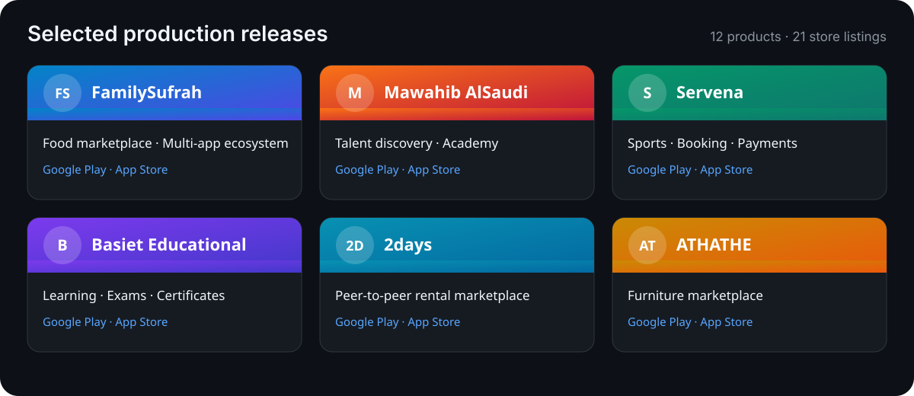

  <picture>
    <source media="(max-width: 640px)" srcset="./assets/profile-header-mobile.svg">
    
  </picture>

  
  
  
  

<strong>16 shipped products · 37 live store listings · Android + iOS</strong>

## Engineering profile

- Flutter Developer at AAIT, based in Cairo, Egypt.
- 3+ years of hands-on experience building and maintaining cross-platform mobile applications.
- **Architecture:** Clean Architecture, SOLID principles, modular features, and reusable UI.
- **State management:** BLoC/Cubit with predictable, maintainable application state.
- **Product systems:** RESTful APIs, Firebase, Google Maps, payments, offline storage, and Arabic/English localization.
- **Delivery:** Responsive interfaces, CI/CD, and releases across the App Store, Google Play, and Huawei AppGallery.

## Core stack

  
  
  
  
  
  
  
  
  
  

## Professional journey

| Period | Role | Company | Focus |
| --- | --- | --- | --- |
| Mar 2025 – Present | Flutter Developer · Full-time | ICRAFTSA | Multi-brand production apps, Firebase, real-time features, payments, localization, and store delivery |
| Mar 2023 – Mar 2025 | Flutter Developer · Full-time | AAIT | Clean Architecture, BLoC/Cubit, REST integrations, reusable UI, and Android/iOS releases |
| Jul 2022 – Sep 2022 | Flutter Developer · Part-time | Algoriza | Legacy modernization, production debugging, caching, and API performance |
| Sep 2021 – Mar 2022 | Flutter Developer | Techunique | Responsive Flutter interfaces, reusable components, and scalable state management |
| Mar 2020 – Jul 2020 | Flutter Developer · Part-time | Artronix | Firebase, real-time data, notifications, maps, and payments |

## Featured repositories

- [Flutter Base](https://github.com/27dandash/flutter_base) — reusable Flutter foundation with structured architecture, tooling, and project conventions.
- [Movie Clean Architecture](https://github.com/27dandash/Movie-Clean-Architecture) — Clean Architecture, BLoC/Cubit, Dio, GetIt, and functional error handling.
- [GoRide Customer](https://github.com/27dandash/GoRide_customer) and [GoRide Driver](https://github.com/27dandash/GoRide_driver) — paired ride-booking experiences with maps, Firebase, notifications, and live trip workflows.
- [Agora Setup in Flutter](https://github.com/27dandash/Agora-Setup-in-flutter) — real-time video calling with Agora and BLoC.
- [Local Notifications in Flutter](https://github.com/27dandash/Setup-Notification-in-flutter) — local and scheduled notifications with timezone and permission handling.
- [Booking Hotel Algoriza](https://github.com/27dandash/Booking-hotel-Algoriza) — hotel-booking flows with BLoC, Dio, maps, and geolocation.

## Selected production work

  <picture>
    <source media="(max-width: 640px)" srcset="./assets/app-gallery-mobile.svg">
    
  </picture>

- **FamilySufrah** (سُفرة) — Arabic-first food marketplace and delivery platform across customer, provider, and delegate apps. 
  `Customer` [Google Play](https://play.google.com/store/apps/details?id=com.flutter.cs.sofra.client) · `Provider` [Google Play](https://play.google.com/store/apps/details?id=com.flutter.cs.sofra.provider) · `Delegate` [Google Play](https://play.google.com/store/apps/details?id=com.flutter.cs.sofra.delivery) / [App Store](https://apps.apple.com/us/app/familysufrah-delegate/id6787687904)

- **Mawahib AlSaudi** (مواهب السعودية) — talent discovery and academy platform with independently branded talent and academy apps. 
  `Talent` [App Store](https://apps.apple.com/eg/app/%D9%85%D9%88%D8%A7%D9%87%D8%A8-%D8%A7%D9%84%D8%B3%D8%B9%D9%88%D8%AF%D9%8A%D9%87-%D9%85%D9%88%D9%87%D8%A8%D9%87/id6776690404) · `Academy` [Google Play](https://play.google.com/store/apps/details?id=com.flutter.cs.MawahibAlSaudi.provider) / [App Store](https://apps.apple.com/eg/app/%D9%85%D9%88%D8%A7%D9%87%D8%A8-%D8%A7%D9%84%D8%B3%D8%B9%D9%88%D8%AF%D9%8A%D9%87-%D8%A7%D9%83%D8%A7%D8%AF%D9%8A%D9%85%D9%8A%D9%87/id6776688772)

- **Servena** (سيرفنا) — sports platform for field booking, matches, training sessions, payments, chat, and rankings. 
  [Google Play](https://play.google.com/store/apps/details?id=com.flutter.cs.servenaPrpject) · [App Store](https://apps.apple.com/us/app/servena-%D8%B3%D9%8A%D8%B1%D9%81%D9%86%D8%A7/id6766030728)

- **Basiet Educational** (بسيط التعليمية) — learning platform for courses, lessons, exams, certificates, and digital study materials. 
  [Google Play](https://play.google.com/store/apps/details?id=com.aait.flutter.basiet) · [App Store](https://apps.apple.com/eg/app/%D8%A8%D8%B3%D9%8A%D8%B7-%D8%A7%D9%84%D8%AA%D8%B9%D9%84%D9%8A%D9%85%D9%8A%D8%A9/id6761849250)

- **2days** (يومين) — map-based peer-to-peer rental marketplace with listings, payments, and agreements. 
  [Google Play](https://play.google.com/store/apps/details?id=com.aait.flutter.twoDays) · [App Store](https://apps.apple.com/us/app/2days-%D9%8A%D9%88%D9%85%D9%8A%D9%86/id6740265856)

- **ATHATHE** (أثاثي) — technology-driven furniture marketplace for discovery, catalog, and purchase journeys. 
  [Google Play](https://play.google.com/store/apps/details?id=com.aait.flutter.athathy) · [App Store](https://apps.apple.com/us/app/%D8%A7%D8%AB%D8%A7%D8%AB%D9%8A/id6677037034)

### Earlier shipped products

- [Rahoul](https://apps.apple.com/sa/app/%D8%B1%D8%AD%D9%88%D9%84-%D8%A7%D9%84%D8%B9%D9%85%D9%8A%D9%84/id6766248186) — a logistics and transportation platform with customer and service-provider experiences.
- [Saudi MedBridge](https://play.google.com/store/apps/details?id=com.aait.flutter.saudimedbridge) — a bilingual classified marketplace for listings, communication, packages, and payments.
- [Mumaken](https://apps.apple.com/us/app/mumaken-%D9%85%D9%85%D9%83%D9%86/id6504041543) — a mobility enablement platform for ride-hailing drivers.
- [MediaCoThink](https://play.google.com/store/apps/details?id=com.aait.mediacothinkUser) — an education platform for courses, exams, lectures, and video calls.
- [Watani](https://apps.apple.com/eg/app/%D9%88%D8%B7%D9%86%D9%8A-watani/id6756347265) — a digital platform supporting the aquaculture sector.
- [Airtah](https://apps.apple.com/eg/app/%D8%A7%D8%B1%D8%AA%D8%AD/id6741735966) — an event-services marketplace for special occasions.

## Education & languages

- **Bachelor of Computer Science** — Higher Technological Institute, HTI · 2019–2022.
- **Languages:** Arabic and English, with production experience delivering Arabic/English localization and RTL/LTR interfaces.

---

  <a href="https://27dandash.github.io">Portfolio</a> ·
  <a href="mailto:27dandash@gmail.com">Email</a> ·
  <a href="https://www.linkedin.com/in/27dandash/">LinkedIn</a> ·
  <a href="https://wa.me/201221769543">WhatsApp</a> ·
  <a href="https://www.instagram.com/27dandash">Instagram</a> ·
  <a href="https://www.facebook.com/share/1KVtFV3MGq/">Facebook</a>

